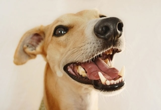

# Canvas Widget for IPython Notebook

This Notebook widget makes it easy to display images from Numpy arrays and also attach Python
callback functions.  The following mouse events are handled: motion, button clicks, wheel rotation.

## Features

- Accept image data from Numpy arrays or URLs.
- Support Python callback functions for front-end mouse events.
- Support Canvas affine transform operations (work in progress)


## Installation

This widget uses [jupyter-pip](https://github.com/jdfreder/jupyter-pip) which allows me to make
this package pip installable!  `jupyter-pip` is specifically designed to solve the distribution
problem for notebook extensions that have associated JavaScript.  `jupyter-pip` takes care of
placing files in all the right places.  No extra action required by the casual user, just install
like any other Python package:

```bash
pip install ipynb_widget_canvas
```

## Dependencies

- `imageio`
- `requests`
- `numpy`
- `ipython`

The [`imageio`](http://imageio.github.io/) package is used to encode image data in the Python back-
end prior to sending it to the browser front-end.  The `requests` package is used for fetching
image data from remote URLs.

Development was done with Python 3.4 and IPython 3.2.1.

# Example Widget Usage

```py
# Setup.
import IPython
import imageio  # See imageio package details at pypi.python.org/pypi/imageio

from widget_canvas import CanvasImage

data_image = imageio.imread('images/Whippet.jpg')

print(data_image.dtype)
print(data_image.shape)

uint8
(220, 320, 3)
```

## Display image widget

Widget properties `width` and `height` allow for direct manipulation displayed image size, independent of source data size.


```py
# Instantiate a widget and display it.
wid_canvas = CanvasImage(data_image)

wid_canvas
```



```py
# Execute this cell a few time to make the image larger...
wid_canvas.width *= 1.2
wid_canvas.height *= 1.2
```

## Mouse event handler


```py
# Build an event handler function.
def simple_handler(wid, info):
    msg = 'Click: {:3d}, {:3d}'.format(info['canvasX'], info['canvasY'])
    print(msg)
```

```py
# Attach the handler to on_click events.
wid_canvas.on_click(simple_handler)
```


