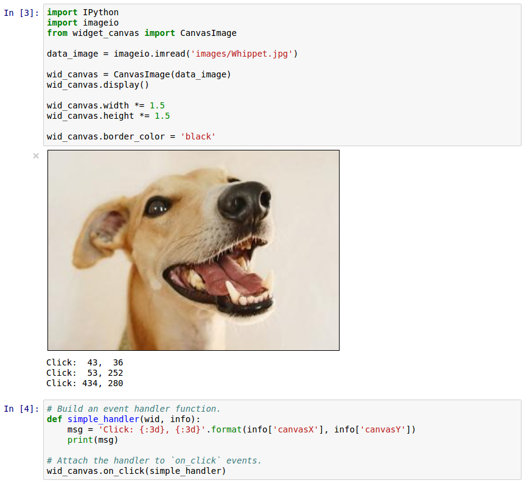

# Canvas Widget for IPython Notebook

This Notebook widget makes it easy to display images from Numpy arrays and also attach Python
callback functions.  The following mouse events are handled: motion, button clicks, wheel rotation.

## Features

- Accept image data from Numpy arrays or URLs.
- Support Python callback functions for front-end mouse events.
- Support Canvas affine transform operations (work in progress)
- Widget properties `width` and `height` allow for direct manipulation displayed image size,
  independent of source data size.

Development was done with Python 3.4 and IPython 3.2.2 and Chrome as my browser.

## Installation

This widget uses [jupyter-pip](https://github.com/jdfreder/jupyter-pip) which allows me to make
this package pip installable!  `jupyter-pip` is specifically designed to solve the distribution
problem for notebook extensions that have associated JavaScript.  `jupyter-pip` takes care of
placing files in all the right places.  No extra action required by the casual user, just install
like any other Python package:

```bash
pip install ipynb_widget_canvas
```

## Dependencies

- `ipython`
- `numpy`
- `pillow`
- `requests`

The package [`pillow`](https://python-pillow.github.io/) is primarily used to compress and encode
image data in the Python back-end prior to sending it to the browser front-end.  `pillow` is used
secondarily to help with basic image file IO functionality. The
[`requests`](http://www.python-requests.org/en/latest/) package is used for fetching image data
from remote URLs.

# Example Widget Usage




# Mouse event handling

A user-defined mouse event handler will receive two items: the widget insance and a `dict`
containing event information.  The information describes the state of the mouse (x,y position,
wheel and buttons) and whether certain keys on the keyboard were also depressed (ctrl, alt, shift).

## Example motion event while pressing LMB

```py
{'timeStamp': 1439155950492,
 'canvasX': 20,
 'canvasY': 216,
 'type': 'mousemove',
 'buttons': 1,
 'shiftKey': False,
 'ctrlKey': False,
 'altKey': False}
```

## Example ctrl-click event

```py
{'timeStamp': 1439156075139,
 'canvasX': 147,
 'canvasY': 37,
 'type': 'click',
 'buttons': 0}
 'shiftKey': False,
 'ctrlKey': True,
 'altKey': False,
```

# Future Work

The HTML5 `Canvas` element has built-in support for imaging zoom, pan, and rotation via a well-
defined affine transform matrix.  See here for examples and more info:
[Mozilla](https://developer.mozilla.org/en-US/docs/Web/API/Canvas_API/Tutorial/Transformations).
The current canvas widget does not expose that functionality to the user, but the necessary
framework is essentially already in place.  My current projects don't require this sort of thing,
so I'm placing this on the back burner for the time being.  I don't think it's too difficult to
connect the JavaScript transform matrix to a Python-equivalent class.  But I know I would get
distracted by other related cool things along the way (e.g. webGL).

So for now I think this is a good stopping point.
